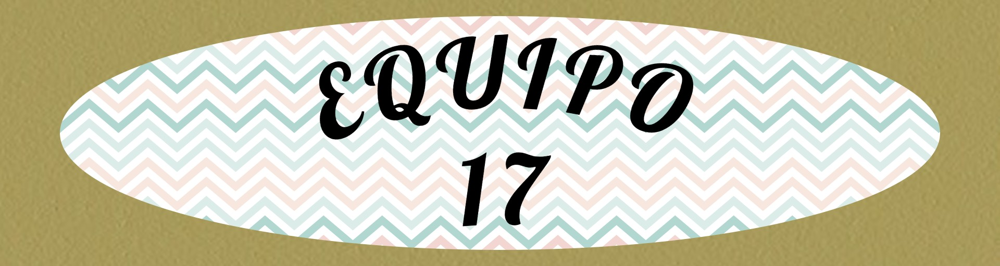

# equipo17progweb
actividades de programacion web
<html>
<head>
<meta charset="utf-8">
</head>
<table width="200" border="1">
  
</table>

<body>
<table width="1326" height="194" border="1">
  <tbody>
    <tr>
<th scope="col"> <figure>
  <figcaption> 2/M6 1737559 Francisco Salvador Flores Juárez francisco.floresju@uanl.edu.mx (Representante)&nbsp;</figcaption>
  <figcaption>2/M6 1901085 Saul David Moreno Franzua Saul.morenofr@uanl.edu.mx</figcaption>
  <figcaption>&nbsp;2/M6 1871905 Jorge Saul Mendez de Leon jorge.mendezdln@uanl.edu.mx&nbsp;</figcaption>
  <figcaption>4/M6 1861678 Grecia Michelle Gallegos Segura grecia.gallegossa@uanl.edu.mx</figcaption>
  <figcaption>&nbsp;2/M6 1857055 Lizeth Sarai García Hernández lizeth.garciahz@uanl.edu.mx&nbsp;</figcaption>
</figure></th>
    </tr>
  </tbody>
</table>

<a href="clase 1.docx" tabindex="7" title="clase 1" accesskey="1" target="new">Resumen 1</a>

</body>
</html>
